__Warning:__ The HTTP Archive dataset is available on BigQuery. Be aware that as a consequence of collecting so much metadata from millions of websites each month, the dataset is _extremely large_—multiple petabytes. Care _must_ be taken to set up [cost controls](https://cloud.google.com/bigquery/docs/custom-quotas) to avoid unexpected bills. Also see our guide to [minimizing query costs](https://har.fyi/guides/minimizing-costs/) for tips on staying under the 1 TB per month free quota.

# Getting Started Accessing the HTTP Archive with BigQuery

The [HTTP Archive](https://httparchive.org) is an open source project that tracks how the web is built. Historical data is provided to show how the web is constantly evolving, and the project is frequently used for research by the web community, scholars and industry leaders. If you are interested in digging into the HTTP Archive and are not sure where to start, then this guide should help you get started quickly.

There are over 1 million pages tracked on desktop and emulated mobile in the most recent HTTP Archive data, and the historical data goes back to 2010. While the HTTP Archive website makes a lot of information available via [curated reports](https://httparchive.org/reports), analyzing the raw data is a powerful way of answering your questions about the web.

All of the data collected by the HTTP Archive is available via [Google BigQuery](https://cloud.google.com/bigquery/). This makes analyzing the data easy because all of the storage and indexing is taken care of for you. And with the processing power behind BigQuery, even some of the most complex queries runs in seconds.

This document is an update to [Ilya Grigorik's 2013 introduction](https://www.igvita.com/2013/06/20/http-archive-bigquery-web-performance-answers/), and walks you through everything you need to get started accessing BigQuery and analyzing the data.


## Setting up BigQuery to Access the HTTP Archive

In order to access the HTTP Archive via BigQuery, you'll need a Google account.  To document this process for new visitors, this example uses a new Google account that has never logged into any Google Cloud services.

1. Navigate to the [Google Cloud Projects Page](https://console.cloud.google.com/start) and log in with your Google account if prompted.  If this is your first time accessing Google Cloud, you may be prompted to accept the terms of service. Once you are logged in, you'll see a page like this -

  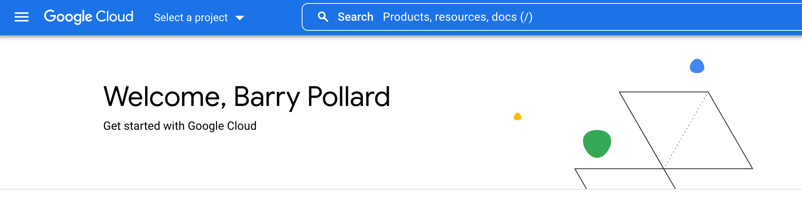

2. Click `Select a project` and then "New Project".   This takes you to a New Project page.

  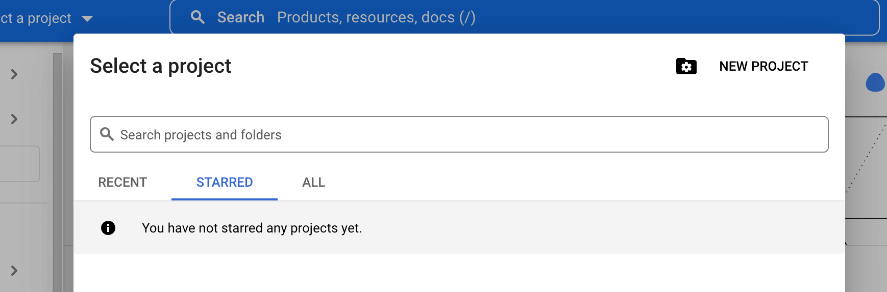

3. Give your project a name and then click the `Create` button.

  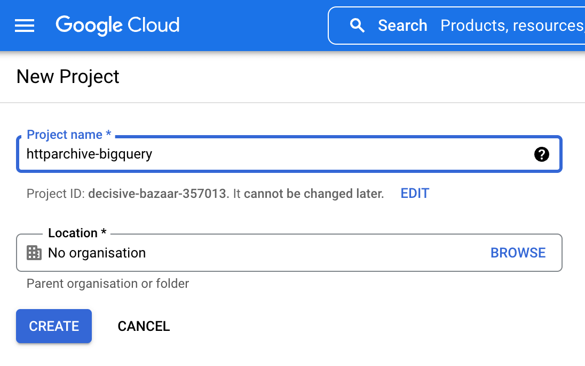

4. Optional: Enable Billing by clicking on the Billing menu item and adding your billing information.

  _Note:  BigQuery has a [free tier](https://cloud.google.com/bigquery/pricing#free-tier) that you can use to get started without enabling billing. At the time of this writing, the free tier allows 10GB of storage and 1TB of data processing per month. Google also provides a [$300 credit for new accounts](https://cloud.google.com/free/docs/frequently-asked-questions#free-trial)._

5. Navigate to the [Big Query console](https://console.cloud.google.com/bigquery) where you should see your project, with no data.

6. In order to add the HTTP Archive tables to your project, click on the "+ Add" button on top of the Explorer sidebar and choose the "Star a project by name" option from the side menu.

7. Type in `httparchive` (case-sensitive) and click `STAR`.

8. You should now see the HTTP Archive data set pinned:

  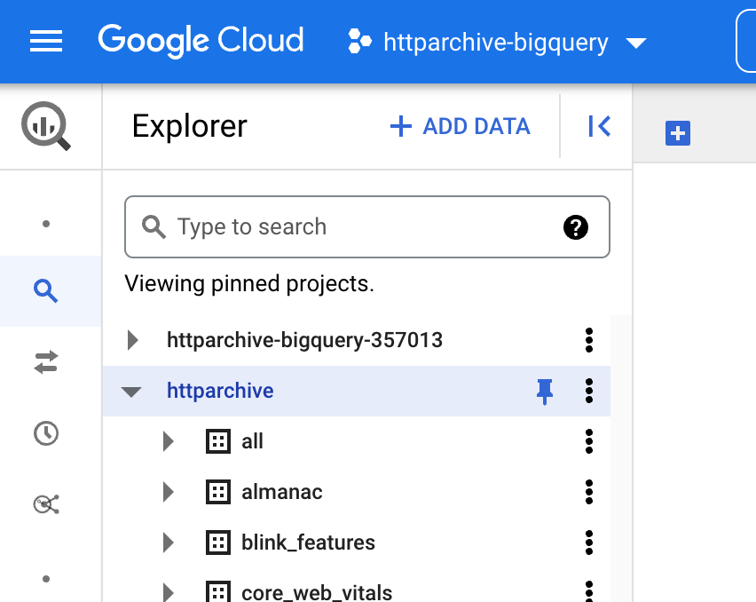

9. Let's run a quick sample query to confirm access is all working. Navigate to the `summary_pages` tables and select the first one:

  

10. Click on the `QUERY` button and select `In a new tab`:

  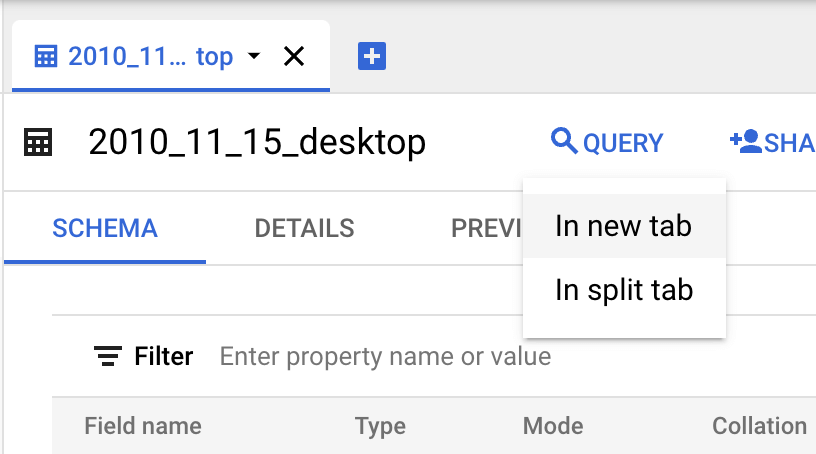

11. Change the query to select some columns (e.g. `SELECT *`) and click the `RUN` button and you should see the results of your query.

  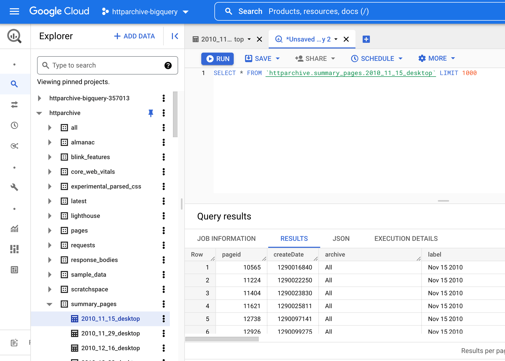

In the next section, we explore the structure of these tables so you can start digging in!

## Understanding how the tables are structured

So, now you have access! But what do you have access to?

The table below outlines what some of the different grouping of tables includes. You'll find summaries of page views and HTTP requests. There are also JSON encoded HAR files for pages, requests, lighthouse reports and even response bodies!

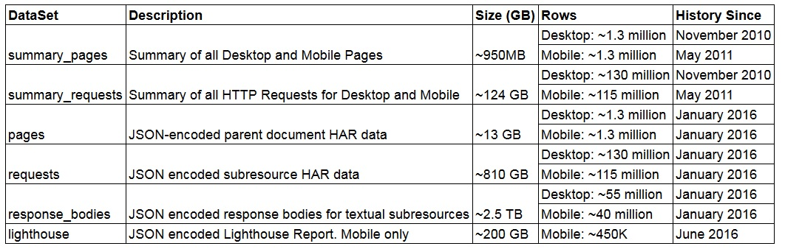

_Note: The size of the tables you query are important because BigQuery is billed based on the number of processed data.  There is 1TB of processed data included in the free tier, so running a full scan query on one of the larger tables can easily eat up your quota. This is where it becomes important to design queries that process only the data you wish to explore_


In order to understand what each of these tables contain, you can click on the table name and view the details. For example, if you expand the `summary_pages` dataset and click on the 2018_09_01_desktop (or mobile) table you can see the schema. Clicking `Details` tells you some information about the table, such as its size and the number of rows. Clicking `Preview` shows an example of some data from the table.
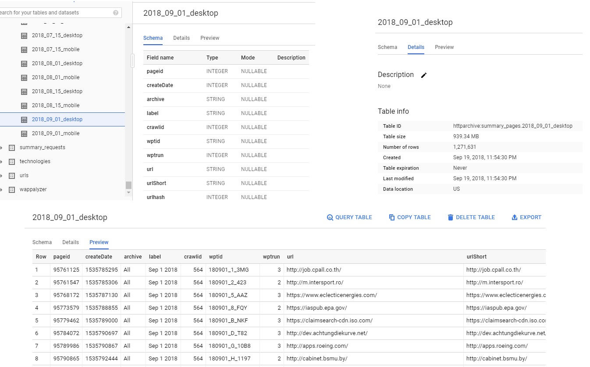

Some of the types of tables you'll find useful when getting started are described below. These table names all follow the format `yyyy_mm_dd_desktop` and `yyyy_mm_dd_mobile`.

### Summary Tables

* `summary_pages` tables:
    * Each row contains details about a single page including timings, # of requests, types of requests and sizes.
    * Information about the page load such # of domains, redirects, errors, https requests, CDN, etc.
    * Summary of different caching parameters.
    * Each page URL is associated with a "pageid".

* `summary_requests` Tables:
    * Every single object loaded by all of the pages.
    * Each object has a requestid and a pageid.  The pageid can be used to JOIN the corresponding summary_pages table.
    * Information about the object, and how it was loaded.
    * Contains some response headers for each object.

### HAR Tables

The HTTP Archive stores detailed information about each page load in [HAR (HTTP Archive) files](https://en.wikipedia.org/wiki/.har). Each HAR file is JSON formatted and contains detailed performance data about a web page.  The [specification for this format](https://w3c.github.io/web-performance/specs/HAR/Overview.html) is produced by the Web Performance Working Group of the W3C. The HTTP Archive splits each HAR file into multiple BigQuery tables, which are described below.

* `pages` tables
    * HAR extract for each page url.
    * Table contains a url and a JSON-encoded HAR file for the document.
    * These tables are large (~13GB as of Aug 2018).

* `requests` tables:
    * HAR extract for each resource.
    * Table contains a document url, resource url and a JSON-encoded HAR extract for each resource.
    * These tables are very large (810GB as of Aug 2018)

* `response_bodies` tables:
    * HAR extract containing response bodies for each request.
    * Table contains a document url, resource url and a JSON-encoded HAR extract containing the first 2MB of each response body.
    * Payloads are truncated at 2MB, and there is a column to indicate whether the payload was truncated.
    * These tables are extremely large (2.5TB as of Aug 2018).

* `lighthouse` tables:
    * Results from a [Lighthouse](https://developers.google.com/web/tools/lighthouse/) audit of a page.
    * Table contains a url, and a JSON-encoded copy of the lighthouse report.
    * Lighthouse was intially only run on mobile, but as of May 2021 also runs as part of the desktop crawl.
    * These tables are very large (2.3 TB for Mobile only as of May 2021)


## Some Example Queries to Get Started Exploring the Data

The [HTTP Archive Discuss section](https://discuss.httparchive.org/) has lots of useful examples and discussion on how to analyze this data.

Now that you are all set up, let's run some queries!  Most HTTP Archive users start off examining the summary tables, so we'll start there as well. Below is a simple aggregate query that tells you how many URLs are contained in the latest HTTP Archive data.

```
SELECT
  COUNT(0) total_pages
FROM
  `httparchive.summary_pages.2018_09_01_desktop`
```

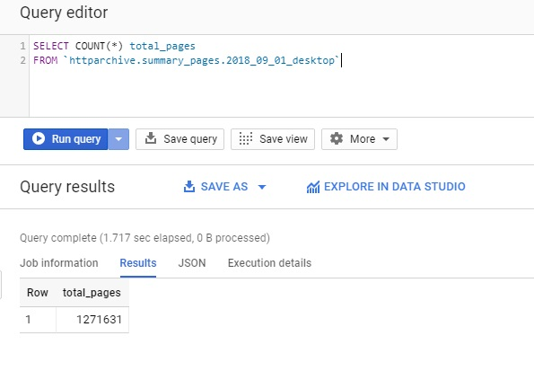

Perhaps you want to JOIN the pages and requests tables together, and see how many page URLs and request URLs are in this data set.

```
SELECT
  COUNT(distinct pages.url) total_pages,
  COUNT(0) total_requests
FROM
  `httparchive.summary_pages.2018_09_01_desktop` pages
INNER JOIN
  `httparchive.summary_requests.2018_09_01_desktop`requests
ON
  pages.pageid = requests.pageid
```

When we look at the results of this, you can see how much data was processed during this query.  Writing efficient queries limits the number of bytes processed - which is helpful since that's how BigQuery is billed.   *Note: There is 1TB free per month*

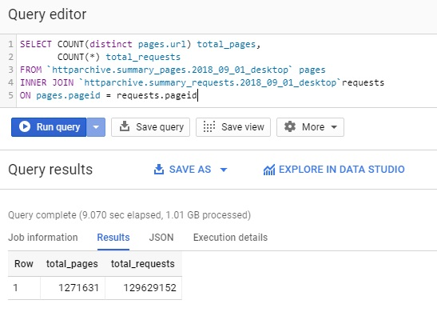

If you look closely, you'll notice that this particular query could actually be written without the JOIN. For example, we can count `distinct pageid` from the `summary_requests` table instead of JOINing the `summary_pages` table. If you run this query, you'll notice that the results are the same as the previous query, and the processed bytes are less.

```
SELECT
  COUNT(distinct pageid) total_pages,
  COUNT(0) total_requests
FROM
  `httparchive.summary_requests.2018_09_01_desktop`requests
```

Next let's summarize  all of the HTTP requests by mime type, and the number of pages that contain at least one request of that mime type.  In the example  below, you can see that I added `mimeType` to the SELECT clause, added a GROUP clause and sorted the results by mimeTypes that have the most requests.

```
SELECT
  mimeType,
  COUNT(distinct pageid) total_pages,
  COUNT(0) total_requests
FROM
  `httparchive.summary_requests.2018_09_01_desktop`requests
GROUP BY
  mimeType
ORDER BY
  total_requests DESC
```

Now things are starting to get interesting.

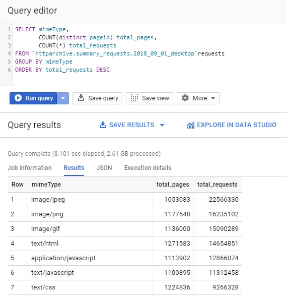

So let's try to learn something from this basic example.   We know from the first example that there are 1.2 million URLs in the latest HTTP Archive dataset. Let's calculate the percent of pages that have each mimeType. To do this, we'll divide the number of pages by the total pages (using our first query as a subquery). Then we'll use a `ROUND()` function to trim the result to 2 decimal points.

```
SELECT
  mimeType,
  COUNT(distinct pageid) total_pages,
  COUNT(0) total_requests,
  ROUND(
    COUNT(distinct pageid) / (
      SELECT
        COUNT(0)
      FROM
        `httparchive.summary_pages.2018_09_01_desktop`
    )
    , 2) percent_pages
FROM
  `httparchive.summary_requests.2018_09_01_desktop`requests
GROUP BY
  mimeType
ORDER BY
  total_requests DESC
```

When analyzing the results from this, you can see the % of websites that use different Content-Types for their JavaScript, you can see that 93% of sites have at least one PNG image, 89% have at least 1 GIF, 48% use JSON, and 3% of sites have MP4 videos on their homepage, etc.

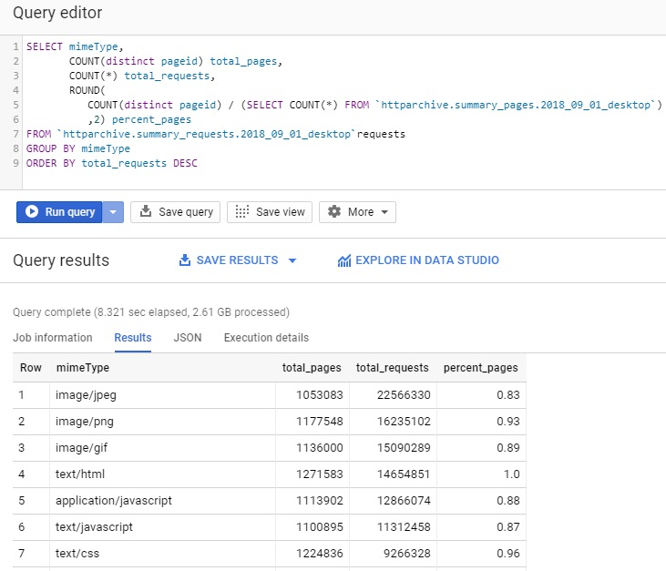

To explore more interactive examples, read the [HTTP Archive Guided Tour](./guided_tour.md).

If you want to explore deeper you have everything you need - infrastructure, documentation, community. Enjoy exploring this data and feel free to share your results and ask questions on the [HTTP Archive Discuss section](https://discuss.httparchive.org/).


