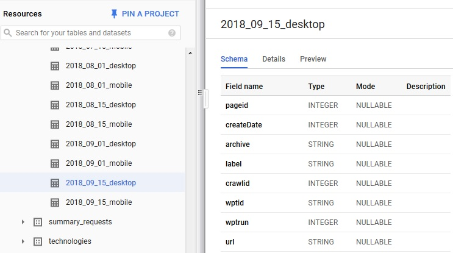
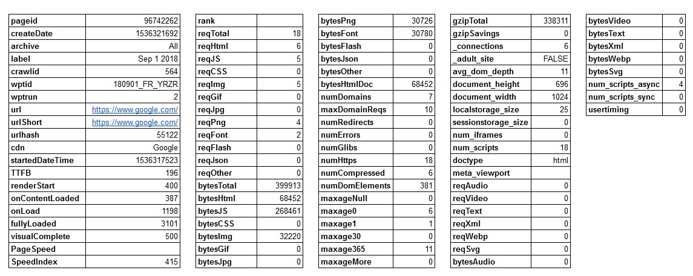
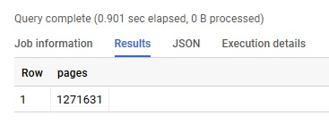
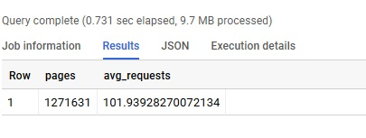
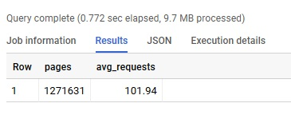
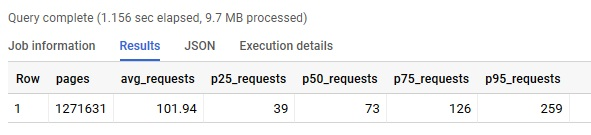
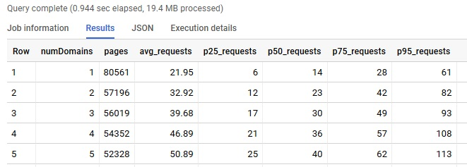
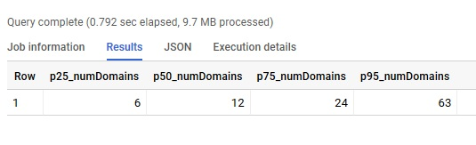
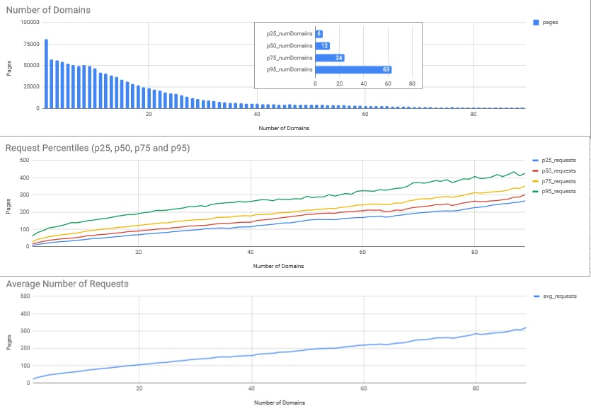
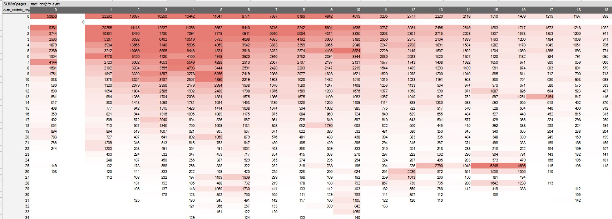

`summary_pages` dataset is being DEPRECATED
===============

**Please use the `httparchive.all.pages` table guide on [har.fyi](http://har.fyi/reference/tables/pages/).**

---

Part 1 - Exploring the Summary Pages Tables
----------------------

The `summary_pages` tables contain details about each page tracked in the archive. It includes timings, number of requests, types of requests and byte sizes. You can see the table structure by selecting one of the tables. You can also preview the contents by clicking on the preview button.



The table below details the contents of a single row from the `summary_pages` table. From looking at this you can see some metrics that may be interesting to aggregate across the entire dataset, and some that can be used as dimensions to summarize the dataset.



Let's start exploring this dataset with a simple query and build up to something interesting. How many pages are included in the 2018-Sep-01 Desktop table? To do this, we'll use [COUNT(0)](https://cloud.google.com/bigquery/docs/reference/standard-sql/functions-and-operators#count) in a simple aggregate query.

```sql
SELECT
  COUNT(0) pages
FROM
  `httparchive.summary_pages.2018_09_01_desktop`
```



Next let's calculate the average number of requests per page across all 1.3 million pages. In the table example shown earlier, the `reqTotal` column contained the total number of requests on the page and Google's homepage had 18 requests. In order to calculate the average, we'll use SQL's [AVG()](https://cloud.google.com/bigquery/docs/reference/standard-sql/functions-and-operators#avg) function.

```sql
SELECT
  COUNT(0) pages,
  AVG(reqTotal) avg_requests
FROM
  `httparchive.summary_pages.2018_09_01_desktop`
```



The average number of requests per page is 101.93928270072134. Let's use the [ROUND() function](https://cloud.google.com/bigquery/docs/reference/standard-sql/functions-and-operators#round) to truncate this to two decimal points.

```sql
SELECT
  COUNT(0) pages,
  ROUND(AVG(reqTotal),2) avg_requests
FROM
  `httparchive.summary_pages.2018_09_01_desktop`
```



You may have heard the phrase "averages are misleading", and that's certainly true here. While it's very easy and familiar to represent stats as averages, it hides a lot of detail and is easily skewed by outliers. Let's explore the number of requests per page with percentiles now.

In Standard SQL, we can use the [APPROX_QUANTILES()](https://cloud.google.com/bigquery/docs/reference/standard-sql/functions-and-operators#approx_quantiles) function to calculate all the percentiles for a field, which is returned as an array.  If we combined that with the [SAFE_ORDINAL()](https://cloud.google.com/bigquery/docs/reference/standard-sql/functions-and-operators#safe_offset-and-safe_ordinal) function then we can select the percentile that interests us from this array.  In the example below, we will create 100 quantiles and then select the Nth index from that array to get the Nth percentile. So, `APPROX_QUANTILES(reqTotal, 100)[SAFE_ORDINAL(50)]` is actually the 50th percentile, or the median.

Let's do this for the 25th, 50th, 75th and 95th percentiles and see how that compares to the average.

```sql
SELECT
  COUNT(0) pages,
  ROUND(AVG(reqTotal),2) avg_requests,
  APPROX_QUANTILES(reqTotal, 100)[SAFE_ORDINAL(25)] p25_requests,
  APPROX_QUANTILES(reqTotal, 100)[SAFE_ORDINAL(50)] p50_requests,
  APPROX_QUANTILES(reqTotal, 100)[SAFE_ORDINAL(75)] p75_requests,
  APPROX_QUANTILES(reqTotal, 100)[SAFE_ORDINAL(95)] p95_requests
FROM
  `httparchive.summary_pages.2018_09_01_desktop`
```



When we look at the results from this query, the median number of requests per page was 73. The average was in fact skewed by outliers. Also, since the 25th percentile is 39 requests and the 75th percentile is 126 requests, that tells us that 50% of the 1.3 million pages tracked by the HTTP Archive have between 39 and 126 requests. This is also known as the [interquartile range](https://en.wikipedia.org/wiki/Interquartile_range).

Now let's add another dimension to this query. The numDomains column counts the number of unique domain names used across all the page's requests. If we add numDomains to the query, and GROUP BY it then we can see these stats broken down by the number of domains per page. In this next example, we'll use the `HAVING` clause to limit the results to domain counts that have at least 1000 pages.

```sql
SELECT
  numDomains,
  COUNT(0) pages,
  ROUND(AVG(reqTotal),2) avg_requests,
  APPROX_QUANTILES(reqTotal, 100)[SAFE_ORDINAL(25)] p25_requests,
  APPROX_QUANTILES(reqTotal, 100)[SAFE_ORDINAL(50)] p50_requests,
  APPROX_QUANTILES(reqTotal, 100)[SAFE_ORDINAL(75)] p75_requests,
  APPROX_QUANTILES(reqTotal, 100)[SAFE_ORDINAL(95)] p95_requests
FROM
  `httparchive.summary_pages.2018_09_01_desktop`
GROUP BY
  numDomains
HAVING
  pages > 1000
ORDER BY
  numDomains ASC
```



The result contained 90 rows of data.  Now that we're dealing with larger result sets, it's time to start graphing them!
In BigQuery you can save your query results to a CSV file, to a Google Sheet or export to Data Studio for visualization. In this guide, we'll save the output to a Google Sheet and then visualize some of this data.

When we look at the relationship between the number of domains and the pages it looks like a fair numbers of sites load content from less than 20 unique domains. Using the same technique we practiced above, we can validate this by calculating the percentiles for the number of domains.

```sql
SELECT
  APPROX_QUANTILES(numDomains, 100)[SAFE_ORDINAL(25)] p25_numDomains,
  APPROX_QUANTILES(numDomains, 100)[SAFE_ORDINAL(50)] p50_numDomains,
  APPROX_QUANTILES(numDomains, 100)[SAFE_ORDINAL(75)] p75_numDomains,
  APPROX_QUANTILES(numDomains, 100)[SAFE_ORDINAL(95)] p95_numDomains
FROM
  `httparchive.summary_pages.2018_09_01_desktop`
```



When we put all of this together, we can see some interesting patterns. For example:

- The number of requests per page increases linearly with respect to the number of domains.
- The long tail of the histogram of domains per site represents a fairly large percentage of sites. 25% of sites have more than 24 domains.
- The median number of requests per page tracks very close to the average
- There is a wide gap between the 75th percentile and 95th percentile requests per page, which remains consistent for all domain groupings


Let's step back and look at another example. In the `summary_pages` table, there are columns named `num_scripts_sync` and `num_scripts_async`, which indicate the number of async and sync scripts per page. We can run a simple query using the techniques you learned above to see how they relate to each other.

```sql
SELECT
  num_scripts_async,
  num_scripts_sync,
  COUNT(0) pages
FROM
  `httparchive.summary_pages.2018_09_01_mobile`
GROUP BY
  num_scripts_async,
  num_scripts_sync
HAVING
  pages > 100
```

The results contain a many rows of data, so let's visualize it in Google Sheets again. In order to look at the relationships between these two metrics I created a pivot table to cross tabulate the results. Then I added conditional formating to the pivot table cells to create a heat map.


If you want to explore the Google Sheets that these examples were graphed in, the file is available [here](https://docs.google.com/spreadsheets/d/17hmRQvleJTmimkufzxH-o0NLLd7R4EamK81yDIwm0BU/edit?usp=sharing). You can also make a copy of the workbook and experiment with some of your own visualization ideas for the data as well.

In [Part 2](./guided_tour_summary_requests.md) we'll explore the summary_requests tables.
