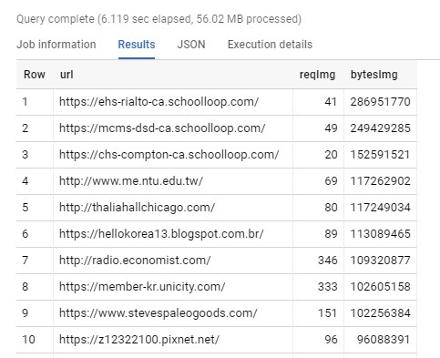
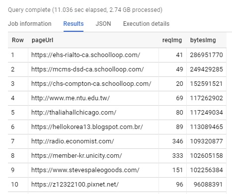
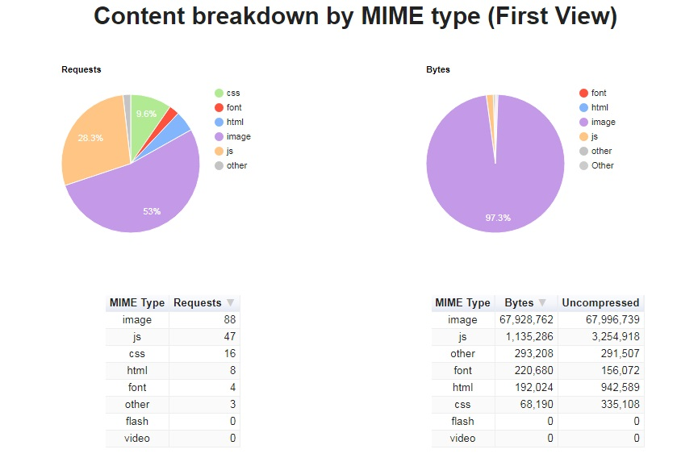
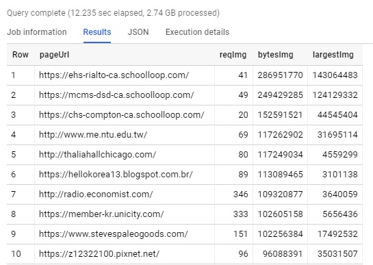
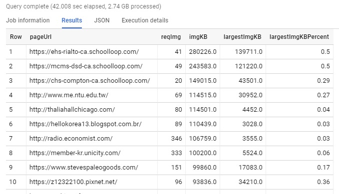
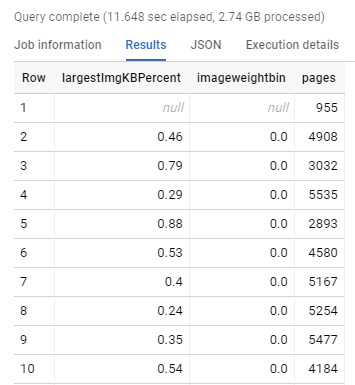
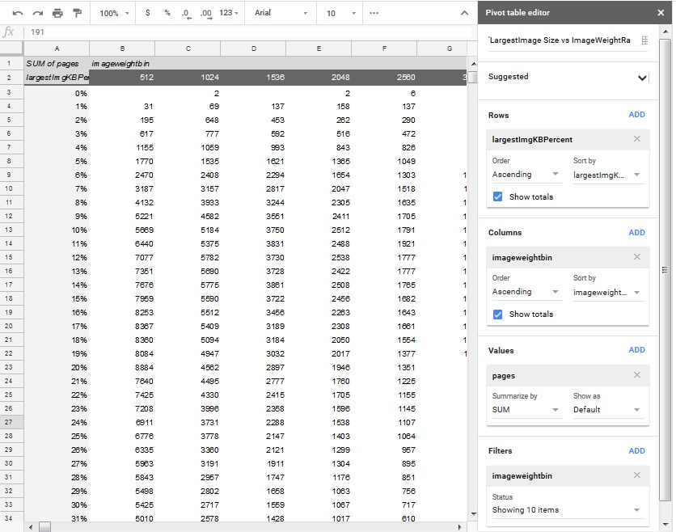
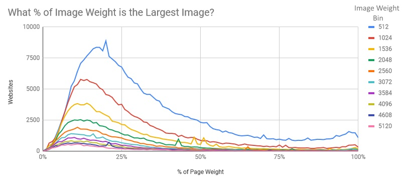

`summary_pages` and `summary_requests` are being DEPRECATED
===============

**Please use the `pages` and `requests` tables correspondingly. Follow the migration guide on [har.fyi](http://har.fyi/guides/migrating-to-all-dataset/).**

---

Part 3 - Joining Summary Page and Requests tables
-------------------

In [Part 1](./guided_tour_summary_pages.md) we examined the `summary_pages` tables. Then in [Part 2](./guided_tour_summary_pages.md) we worked with the `summary_requests` tables. Now let's look at how we can combine both the summary_requests and summary_pages tables to perform a deeper analysis. In the following example, we're going to investigate the following question:
  "is image weight more commonly a factor of 1 large image, or many smaller images?".

Let's start with a simple query against the pages table. This is a simple query that just selects the URL, the number of images and the bytes of those images.

```
SELECT
  url pageUrl,
  reqImg,
  bytesImg
FROM
  `httparchive.summary_pages.2018_09_01_desktop`
ORDER BY
  bytesImg DESC
```



In the previous example we didn't use the requests table at all. However if we wanted to, we could do the same analysis by JOINing the request table. In order to do this, I've made the following modifications to the query above:
* Named the tables (ie, so we can reference "httparchive.summary_pages.2018_09_01_desktop" as "pages")
* Reference the tables for some of the columns that exist in both tables (such as pages.url)
* Since we're focuing on images, we'll include `requests.type="image"` in our WHERE clause.
* JOIN the tables `ON pages.pageid = requests.pageid`
The below query is identifical to the previous one, but uses both tables.

```
SELECT
  pages.url pageUrl,
  COUNT(0) reqImg,
  SUM(respBodySize) bytesImg
FROM
  `httparchive.summary_pages.2018_09_01_desktop` pages
INNER JOIN
  `httparchive.summary_requests.2018_09_01_desktop` requests
ON
  pages.pageid = requests.pageid
WHERE
  requests.type = "image"
GROUP BY
  pageUrl
ORDER BY
  bytesImg DESC
```


Some of these image weights seem quite extreme, but these represent the most image heavy sites in the archive. If you want to validate this, you can load one of the pages in DevTools or WebPageTest and see for yourself.  For example based on the results above,  http://thaliahallchicago.com/ has 80 images totaling 117MB. WebPageTest confirms that this is accurate (although the image weight likely changed slightly between when the HTTP Archive saw the page vs when this manual test was performed.



If this was all the information we needed, then JOINING the table would have been unecessary. However we want to look at the relationship between the largest image and the overall image weight. In the query below you can add `MAX(responseBodySize)` to look for the size of the largest image.

```
SELECT
  pages.url pageUrl,
  COUNT(0) reqImg,
  SUM(respBodySize) bytesImg,
  MAX(respBodySize) largestImg
FROM
  `httparchive.summary_pages.2018_09_01_desktop` pages
INNER JOIN
  `httparchive.summary_requests.2018_09_01_desktop` requests
ON
  pages.pageid = requests.pageid
WHERE
  requests.type = "image"
GROUP BY
  pageUrl
ORDER BY
  bytesImg DESC
```


Now let's add a simple formula to look at the relationship of the largest image on a page to the image weight:  largestImg/bytesImg. However since we can't reference the aggregate names in the query, we'll include the function calls. `MAX(respBodySize)/SUM(respBodySize)`.

We'll use the ROUND function to clean up some of this data and make it more readable. The query below converts the bytes to KB by dividing by 1024.  And then rounds all the numbers.

```
SELECT
  pages.url pageUrl,
  COUNT(0) reqImg,
  ROUND(SUM(respBodySize)/1024) imgKB,
  ROUND(MAX(respBodySize)/1024) largestImgKB,
  ROUND(MAX(respBodySize) / SUM(respBodySize),2) largestImgKBPercent
FROM
  `httparchive.summary_pages.2018_09_01_desktop`  pages
INNER JOIN
  `httparchive.summary_requests.2018_09_01_desktop` requests
ON
  pages.pageid = requests.pageid
WHERE
  requests.type = "image"
GROUP BY
  pageUrl
ORDER BY
  imgKB DESC
```



The results above show us the number of images, the image weight, the size of the largest image, and the percentage of image weight represented by that largest image. In the example we explored earlier - http://thaliahallchicago.com/ had 80 images, with the largest image being 4,452KB.   This image represents 4% of the image weight, indicating that there are most likely multiple large images on the page.

Since there are 1.3 million pages in the HTTP Archive, we have 1.3 million rows in this resultset. Let's aggregate the results from this query now to learn something about the data.

```
SELECT
  largestImgKBPercent,
  ROUND(imgKB/512)*512 imageweightbin,
  COUNT(0) pages
FROM (
    SELECT
      pages.url pageUrl,
      COUNT(0) reqImg,
      ROUND(SUM(respBodySize)/1024) imgKB,
      ROUND(MAX(respBodySize)/1024) largestImgKB,
      ROUND(MAX(respBodySize) / SUM(respBodySize),2) largestImgKBPercent
    FROM
      `httparchive.summary_pages.2018_09_01_desktop`  pages
    INNER JOIN
      `httparchive.summary_requests.2018_09_01_desktop`  requests
    ON
      pages.pageid = requests.pageid
    WHERE
      requests.type = "image"
    GROUP BY
      pageUrl
    ORDER BY
      imgKB DESC
)
GROUP BY
  largestImgKBPercent,
  imageweightbin
ORDER BY
  largestImgKBPercent
```


This resultset has 6863 rows, which is easier to work with. Let's export it to Google Sheets and then see what we can learn from it.

In Google Sheets, we can create a pivot table to cross tabulate the results. For example we can look at the Largest Image % vs the Image Weight Bin by using `largestImgKBPercent` as the rows, `imageweightbin` as the columns, and `pages` as the values. Now instead of 6863 rows, we have 100 rows and a large number of columns. We can also limit the number of columns using a filter, and in this example I've configured a filter on imageweightbin so that we're looking at pages with less than 5MB of images (this accounts for 90% of sites in the HTTP Archive that load images).



If we graph this, we can see an interesting pattern. The larger the image weight, the further the distribution moves to the left. This seems to indicate that sites with a very large image weight tend to have multiple large images rather than 1 poorly configured large image.



You can see another example of JOINing the `summary_requests` and `summary_pages` tables in [this post about the distribution of 1st and 3rd party resources](https://discuss.httparchive.org/t/what-is-the-distribution-of-1st-party-vs-3rd-party-resources/100/14). In this example, we are using the `summary_pages` url column to classify whether the `summary_requests` data is first or third party content. The result of that query is then used as a subquery and aggregated by the percentage of third party content.

```
SELECT
  percent_third_party,
  count(0) as total
FROM (
    SELECT
      pages.url, FLOOR((SUM(IF(STRPOS(NET.HOST(requests.url),REGEXP_EXTRACT(NET.HOST(pages.url), r'([\w-]+)'))>0, 0, 1)) / COUNT(0))*100) percent_third_party
    FROM
      httparchive.summary_pages.2018_08_15_desktop pages
    JOIN
      httparchive.summary_requests.2018_08_15_desktop requests
    ON
      pages.pageid = requests.pageid
    GROUP BY
      pages.url
  )
GROUP BY
  percent_third_party
ORDER BY
  percent_third_party
```

This analysis showed that 38% of sites have more than 75% third party content and a staggering 27% had more than 90%.


If you want to explore the Google Sheets that the examples in this guide were graphed in, the file is available [here](https://docs.google.com/spreadsheets/d/15Hie8J0XRHcG6OGTRx14p2cAouQcxiq73Hu2dpsgvxM/edit?usp=sharing). You can also make a copy of the workbook and experiment with some of your own visualization ideas for the data as well.

In Part 4 (Coming Soon) we'll look at HAR files, and how you can extract data from the JSON encoded payloads and analyze them.

