Part 2 - Exploring the Summary Requests Tables
-------------------
The `summary_requests` tables contain details about all HTTP requests made by the ~1.3 million pages tracked in the archive. This dataset is quite large, as you can see by the aggregate query that counts all rows in the table 

```
SELECT COUNT(*)
FROM `httparchive.summary_requests.2018_09_01_desktop`
```

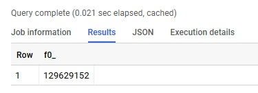

In [Part 1](./guided_tour_summary_pages.md) we looked at a sample of what the `summary_pages` table data looked like. The following table shows a sample of a row from the `summary_requests` table.   The first two columns contain a requestid and pageid.  The requestid is a unique identifier for each request.  The pageid corresponds to the pageid column in the `summary_pages` table, and can be used to relate the two datasets. There are also numerous other columns for collecting information from request and response headers, types of objects, and even a partial dump of HTTP response headers in the respOtherHeaders column.
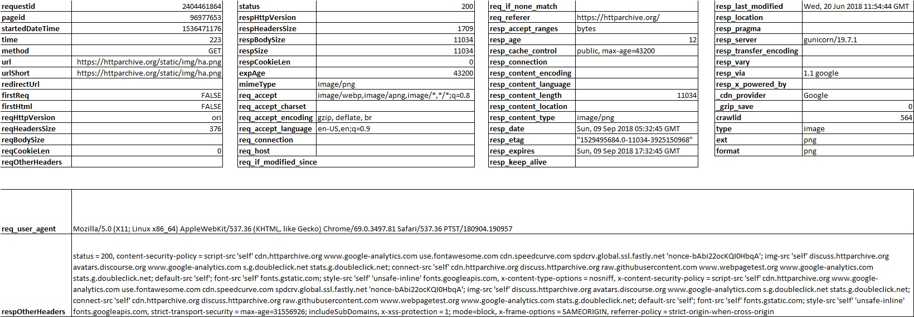

Since each page tracked by the HTTP Archive has a unique pageid, we can also summarize these results by the number of distinct pageid's.  For example, the following query tells us that there are 129,629,152 requests in this dataset and that they're loaded from 1,271,631 pages. 

```
SELECT COUNT(*) requests,
       COUNT(DISTINCT pageid) pages
FROM `httparchive.summary_requests.2018_09_01_desktop`
```
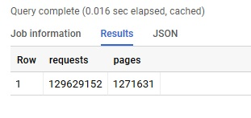


We already knew the number of pages from previous queries, but now lets add a dimension to the query to explore this table some more. The following query adds the 'type' column, which indicates the type of resource loaded (ie, script, image, css, etc)

```
SELECT type, 
       COUNT(*) requests,
       COUNT(DISTINCT pageid) pages
FROM `httparchive.summary_requests.2018_09_01_desktop`
GROUP BY type
ORDER BY requests DESC
```
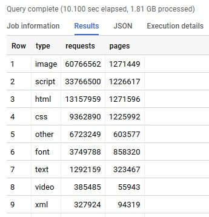

When we look at this data we can see counts of requests and pages for each content type. But what if we want the percentage of total? You could divide by the numbers that we know. But a more repeatable way of doing this would be to include a subquery. In the following query you'll notice that the number of requests per type is divided by the total number of requests. And likewise the same is done for pages.

```
SELECT type, 
       COUNT(*) requests,
       COUNT(DISTINCT pageid) pages,
       COUNT(*) / (SELECT COUNT(*) FROM `httparchive.summary_requests.2018_09_01_desktop`) percent_requests,
       COUNT(DISTINCT pageid) / (SELECT COUNT(DISTINCT pageid) FROM `httparchive.summary_requests.2018_09_01_desktop`) percent_pages
FROM `httparchive.summary_requests.2018_09_01_desktop`
GROUP BY type
ORDER BY requests DESC
```

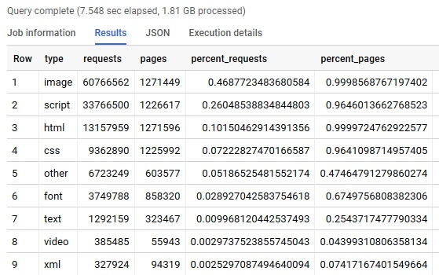

As we learned in Part 1, we can use the ROUND() function to trim the result to 2 decimal points for readability.

```
SELECT type, 
       COUNT(*) requests,
       COUNT(DISTINCT pageid) pages,
       ROUND(COUNT(*) / (SELECT COUNT(*) FROM `httparchive.summary_requests.2018_09_01_desktop`),2) percent_requests,
       ROUND(COUNT(DISTINCT pageid) / (SELECT COUNT(DISTINCT pageid) FROM `httparchive.summary_requests.2018_09_01_desktop`),2) percent_pages
FROM `httparchive.summary_requests.2018_09_01_desktop`
GROUP BY type
ORDER BY requests DESC
```
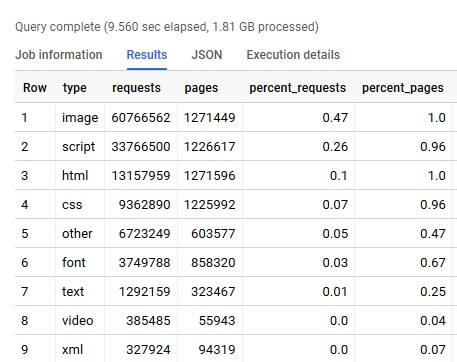


Graphing this we can see both the distribution of content types across all requests in the archive as well as the popularity of certain types of content on each site.  For example, 100% of sites contained images and HTML.  96% contain JavaScript and CSS. 67% contain custom webfonts and 4% contain video files.

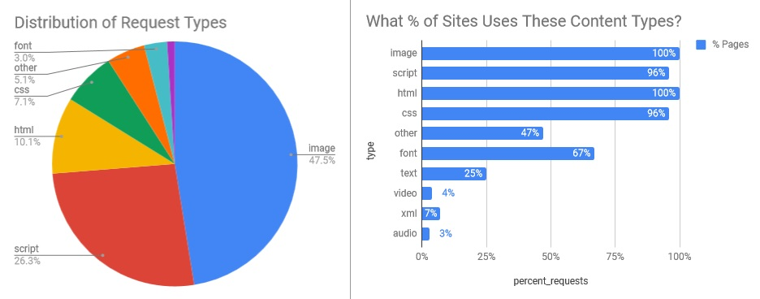

Let's say we want to extend this query some more and look at the formats of each type. Now we have a query that is summarizing the % of requests and pages for each file type and format.

```
SELECT type, format,
       COUNT(*) requests,
       COUNT(DISTINCT pageid) pages,
       ROUND(COUNT(*) / (SELECT COUNT(*) FROM `httparchive.summary_requests.2018_09_01_desktop`),2) percent_requests,
       ROUND(COUNT(DISTINCT pageid) / (SELECT COUNT(DISTINCT pageid) FROM `httparchive.summary_requests.2018_09_01_desktop`),2) percent_pages
FROM `httparchive.summary_requests.2018_09_01_desktop`
GROUP BY type, format
ORDER BY requests DESC
```
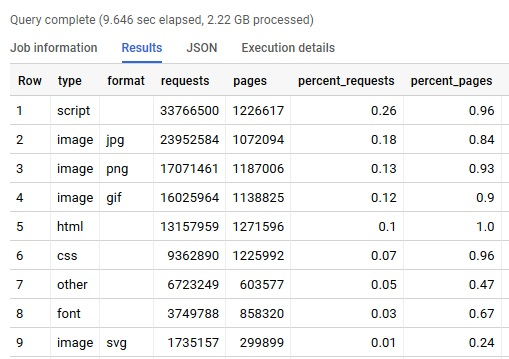

Using a WHERE clause we can filter out all of the non-Image content and examine the popularity of various image formats. For example, how often is jpg, gif, webp, etc used. 
 
```
SELECT type, format,
       COUNT(*) requests,
       COUNT(DISTINCT pageid) pages,
       ROUND(COUNT(*) / (SELECT COUNT(*) FROM `httparchive.summary_requests.2018_09_01_desktop` WHERE type="image"),2) percent_image_requests,
       ROUND(COUNT(DISTINCT pageid) / (SELECT COUNT(DISTINCT pageid) FROM `httparchive.summary_requests.2018_09_01_desktop`),2) percent_pages
FROM `httparchive.summary_requests.2018_09_01_desktop`
WHERE type = "image"
GROUP BY type, format
ORDER BY requests DESC
```

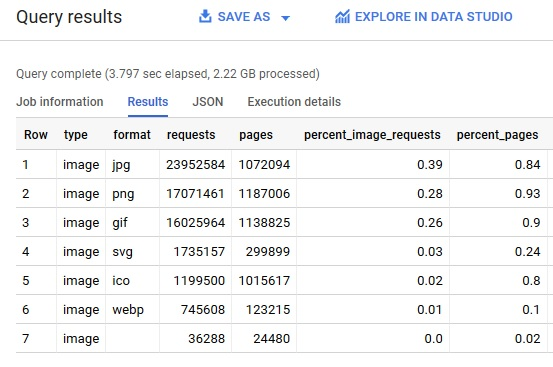

*Note: It's important to understand the bias in the data when we are doing this type of analysis. While we do have a very diverse set of 1.3 million page views - the technology used to parse these pages is Chrome browsers (both Desktop and Emulated mobile). Because of this, some formats may be under-represented - since Chrome supports webp but not jpeg-xr or jpeg2000.  You may find cases like this with other type of technologies as well - for example custom web font types that vary based on browser support.*

Let's graph the results now to see what types of images are being served to Chrome browsers.

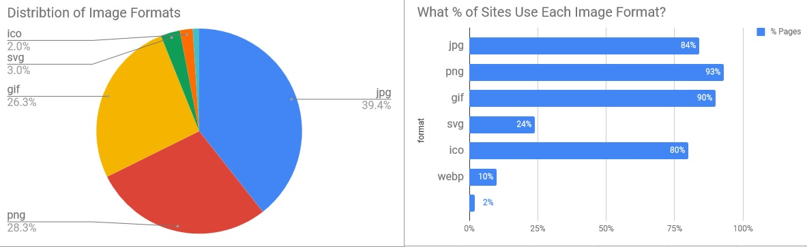

Let's explore a simple histogram of the requests dataset by looking at the distribution of response sizes. Histograms are useful for representing the distribution of data, by organizing a range of values into "bins" (or buckets), and then counting the number of values that fall into each of the bins. If you are not familiar with this type of visualization, then you can [read more about histograms here](https://en.wikipedia.org/wiki/Histogram). 

In the example below, we'll be using a histogram to visualize the size of individual requests served from websites across the entire dataset. To do this, we'll be using the respBodySize column. This column represents the size of the response payload in bytes. Since 1 byte is very granular, we'll divide by 1024 to get to 1 KB and then by 100 so that we are looking at this data with bin sizes of 100KB. We'll also wrap this in a `ROUND()` function to remove the decimal points and then multiply the result by 100. Using this technique, 1234567 bytes would be rounded to a bin of 1200 KB.

```
SELECT ROUND(respBodySize/(1024*100))*100 responseSize100KB, 
       COUNT(*) requests
FROM `httparchive.summary_requests.2018_09_01_desktop`
GROUP BY responseSize100KB
HAVING responseSize100KB > 0
ORDER BY responseSize100KB ASC
```
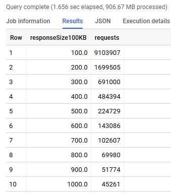

If we export the result to Google Sheets, we can work with the data some more. For example, we can added a column with the % of requests, and use a simple formula to calcuate the percentages. In Google Sheets you can copy/paste the formula for the entire column to quickly populate the % Requests column. When we analyze this data we can see that that 70% of requests have a response size less than 100KB. Try repeating this with 10KB bin sizes and you'll be able to see the spread of response sizes with more granularity.

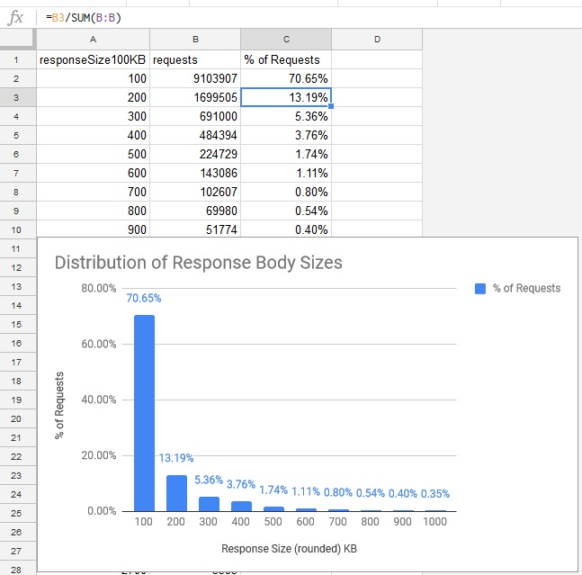

You can find many examples of working with the `summary_requests` table in the [HTTP Archive discussion forums](https://discuss.httparchive.org/). For example, [this article](https://discuss.httparchive.org/t/cache-control-immutable-a-year-later/1195) used this table to analyze how the Immutable Cache-Control directive is used on the web. 

If you want to explore the Google Sheets that these examples were graphed in, the file is available [here](https://docs.google.com/spreadsheets/d/15Hie8J0XRHcG6OGTRx14p2cAouQcxiq73Hu2dpsgvxM/edit?usp=sharing). You can also make a copy of the workbook and experiment with some of your own visualization ideas for the data as well.

In [Part 3](./guided_tour_summary_pages_requests.md) we'll look at how you can use SQL JOINs to analyze both the `summary_pages` and `summary_requests` datasets.
